# F-Zone Event Management
## Client Handover Guide / ക്ലയന്റ് ഗൈഡ്

**Prepared for:** Platform owner / client  
**App name:** F-Zone Event Management System  
**Date:** May 2026  
**Support contact:** _(your developer phone / email here)_

---

## 1. Welcome / സ്വാഗതം

### Malayalam

F-Zone Event Management ഒരു **ഓൺലൈൻ ഇവന്റ് & രജിസ്ട്രേഷൻ സിസ്റ്റം** ആണ്. ഇതിലൂടെ നിങ്ങൾക്ക്:

- ഇവന്റുകൾ സൃഷ്ടിക്കാം
- ഇൻവെസ്റ്റർമാരുടെ ഡാറ്റ മാനേജ് ചെയ്യാം
- പúblic രജിസ്ട്രേഷൻ & പേയ്മെന്റ് (Razorpay) സ്വീകരിക്കാം
- QR സ്കാൻ വഴി ഗേറ്റ് ചെക്ക്-ഇൻ നടത്താം
- പേയ്മെന്റ്, റീഫണ്ട്, ഓഡിറ്റ് ലോഗ് എന്നിവ കാണാം
- സ്റ്റാഫ് അക്കൗണ്ടുകൾ & permissions നിയന്ത്രിക്കാം

ഈ PDF-ൽ എല്ലാ സ്റ്റെപ്പുകളും **ചിത്രങ്ങളോടെ** Malayalam + English രൂപത്തിൽ നൽകിയിട്ടുണ്ട്.

### English

F-Zone Event Management is an **online event and registration platform**. With it you can:

- Create and manage events
- Maintain your investor (participant) database
- Accept public registrations and Razorpay payments
- Scan QR codes at the gate for check-in
- View payments, issue refunds, and review audit logs
- Manage staff accounts with role-based permissions

This guide explains every step in **Malayalam and English**, with screenshots.

---

## 2. Your Live Links / നിങ്ങളുടെ ലൈവ് ലിങ്കുകൾ

| Item | URL |
|------|-----|
| **Staff app (main login)** | https://fzone-event-managment-system.vercel.app/login |
| **Staff dashboard** | https://fzone-event-managment-system.vercel.app/ |
| **Backend API** _(info only)_ | https://fzone-api.onrender.com |
| **Health check** | https://fzone-api.onrender.com/health |

### Malayalam — പ്രധാന കാര്യങ്ങൾ

1. **സ്റ്റാഫ്** മാത്രം `/login` വഴി ലോഗിൻ ചെയ്യണം.
2. **പúblic ഇവന്റ് ലിങ്ക്** ഫോർമാറ്റ്: `https://fzone-event-managment-system.vercel.app/event/{event-id}`
3. **ഇൻവെസ്റ്റർ പോർട്ടൽ:** `https://fzone-event-managment-system.vercel.app/portal/{event-id}`
4. Render free plan-ൽ 15 മിനിറ്റ് idle ആയാൽ server **30–60 സെക്കൻഡ്** wake up ചെയ്യും — ആദ്യ login-ൽ കാത്തിരിക്കേണ്ടി വരാം.

### English — Important notes

1. Only **staff** use `/login`.
2. **Public event registration** link format: `https://fzone-event-managment-system.vercel.app/event/{event-id}`
3. **Investor portal:** `https://fzone-event-managment-system.vercel.app/portal/{event-id}`
4. On Render free tier, after 15 minutes idle the server may take **30–60 seconds** to wake up on first request.

---

## 3. First Login (Super Admin) / ആദ്യ ലോഗിൻ

### Malayalam

1. ബ്രൗസർ തുറന്ന് https://fzone-event-managment-system.vercel.app/login എന്ന adres-ൽ പോകുക.
2. **Super Admin email:** `fzone@gmail.com`
3. **Password:** ഡെവലപ്പർ secure channel (WhatsApp / phone) വഴി നൽകിയ password ഉപയോഗിക്കുക — **ഈ PDF-ൽ password ഇല്ല.**
4. **Sign in** ക്ലിക്ക് ചെയ്യുക.
5. വിജയകരമായി login ആയാൽ **Overview** dashboard കാണും.

**നിങ്ങൾ കാണുന്നത്:** KPI cards (Registrations, Revenue, Database), Running Events, Staff Tools.

> ⚠️ Password ഒരിക്കലും staff-ന് share ചെയ്യരുത്. ഓരോ staff-നും വെവ്വേറെ account ഉണ്ടാക്കുക.

### English

1. Open https://fzone-event-managment-system.vercel.app/login in your browser.
2. **Super Admin email:** `fzone@gmail.com`
3. **Password:** Use the password shared securely by your developer — **not included in this PDF.**
4. Click **Sign in**.
5. You will land on the **Overview** dashboard.

**What you will see:** KPI cards, Running Events panel, and Staff Tools shortcuts.

> ⚠️ Never share the super admin password with staff. Create separate accounts for each person.

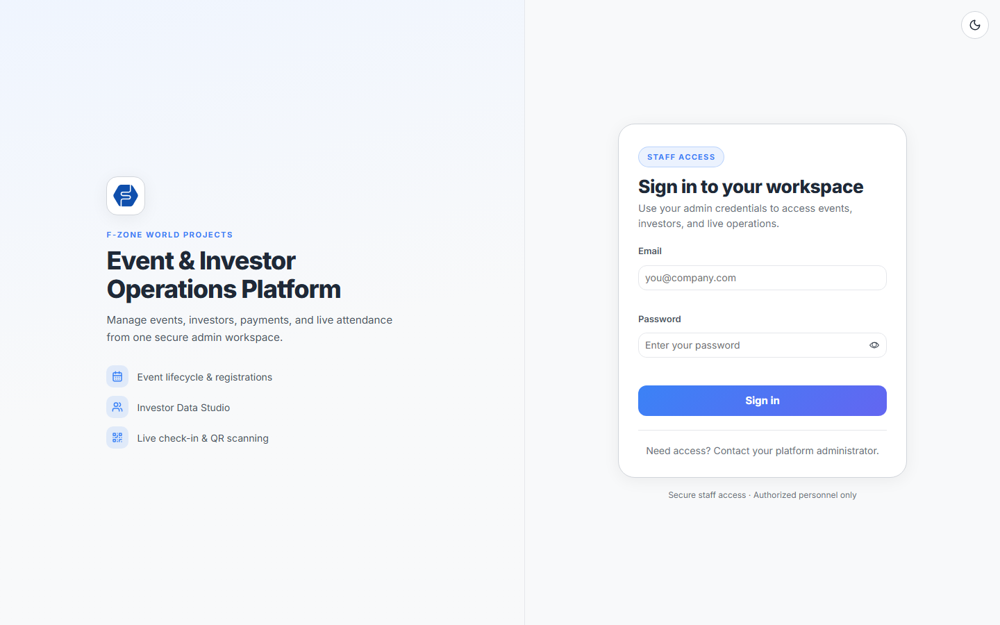

---

## 4. Dashboard Overview / ഡാഷ്ബോർഡ്

### Malayalam

Overview (`/`) ൽ നിങ്ങൾക്ക് മുഴു platform-ന്റെ snapshot കാണാം:

| Card | അർത്ഥം |
|------|--------|
| Total Registrations | എല്ലാ ഇവന്റ് രജിസ്ട്രേഷനുകൾ |
| Entry Passes Issued | Issue ചെയ്ത passes |
| Verified Check-ins | QR scan ചെയ്തവർ |
| Pending Entry | ഇനി scan ചെയ്യാത്തവർ |
| Total Revenue | Razorpay payments |
| Participant Database | CRM investor count |

**Running Events** — Upcoming / Live / Past tabs.  
**Staff Tools** — quick links to all admin pages.  
**Recent Registrations** — latest bookings preview.

### English

The Overview page shows your platform at a glance:

| Card | Meaning |
|------|---------|
| Total Registrations | All event registrations |
| Entry Passes Issued | Passes generated |
| Verified Check-ins | QR scans completed |
| Pending Entry | Not yet scanned |
| Total Revenue | Successful Razorpay payments |
| Participant Database | Investor records in CRM |

Use **Running Events** tabs and **Staff Tools** for navigation.

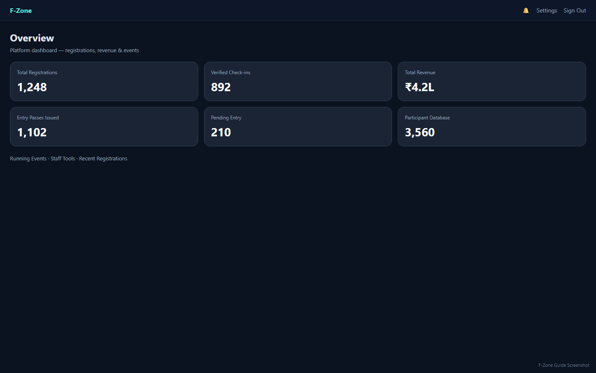

---

## 5. Staff Accounts & Permissions / സ്റ്റാഫ് അക്കൗണ്ടുകൾ

> **Super Admin only** (`fzone@gmail.com`)

### Malayalam

1. **Settings** → **Staff accounts** section.
2. **Add staff member:** Email, Password (min 8 chars), Role തിരഞ്ഞെടുക്കുക.
3. **Admin** role → account **Pending** ആയി തുടങ്ങും — login ചെയ്യാൻ activate ചെയ്യണം.
4. Pending row-ൽ **Activate** → permission checklist → **Activate**.
5. Active admin-ന് **Permissions** edit / **Disable** ചെയ്യാം.

**Roles:**

| Role | ഉപയോഗം |
|------|--------|
| Super Admin | Full access + staff management |
| Admin | Permission-based access |
| Scanner | Gate QR & attendance only |
| Finance | Payments & refunds only |

### English

1. Go to **Settings** → **Staff accounts**.
2. **Add staff member** with email, password, and role.
3. **Admin** accounts start as **Pending** until you activate them with permissions.
4. Click **Activate** on pending rows, select permissions, confirm.
5. Use **Permissions** to edit access or **Disable** to block login.

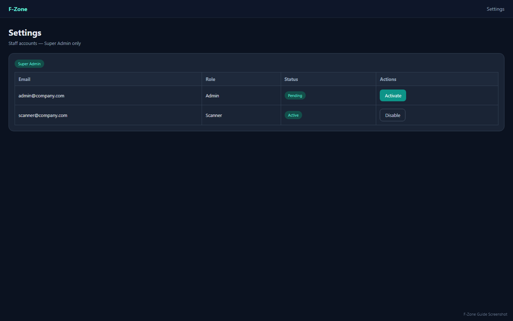

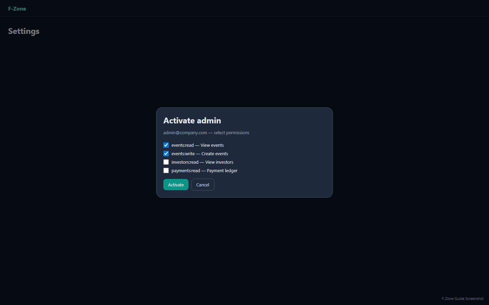

---

## 6. Create & Manage Events / ഇവന്റ് സൃഷ്ടിക്കൽ

### Malayalam

1. Staff Tools → **Create Event** (`/event`).
2. Sections പൂരിപ്പിക്കുക:
   - **Basics** — name, description
   - **Schedule** — date & time
   - **Registration window** — open/close times
   - **Pricing & guests** — free/paid, guest limit
   - **Entry ticket design** — ticket look
   - **Location** — venue
3. **Publish Event** ക്ലിക്ക് ചെയ്യുക.
4. Right panel **Your Events** → **Copy link** = public registration URL.
5. **Close registration** = new bookings stop.
6. **Edit** / **Delete** event actions available.

**Public link example:**  
`https://fzone-event-managment-system.vercel.app/event/EVENT_ID_HERE`

### English

1. Open **Create Event** from Staff Tools.
2. Fill all Event Studio sections and click **Publish Event**.
3. From **Your Events**, use **Copy link** for the public registration URL.
4. Use **Close registration** to stop new bookings.

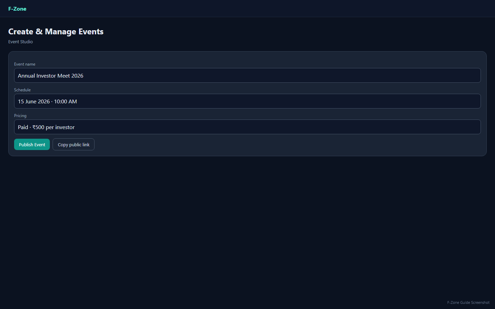

---

## 7. Public Registration / പúblic രജിസ്ട്രേഷൻ

### Malayalam

Investor/public user event link-ൽ പോകുമ്പോൾ:

1. **Mobile Number** enter ചെയ്യുക (database-ൽ ഉള്ള number മാത്രം).
2. Investor verify ആയാൽ **Digital Entry Pass** preview.
3. Guests allowed ആണെങ്കിൽ guest name + gender add ചെയ്യുക.
4. Paid event ആണെങ്കിൽ **Razorpay Pay** → payment complete.
5. **Confirm Booking** → registration complete.
6. **Register & Enter Meeting Portal** → portal access.

**Blocked / refunded** investors-ന് warning banner കാണും.

### English

When an investor opens the public event link:

1. Enter **mobile number** (must exist in your database).
2. After verification, see the digital entry pass preview.
3. Add guests if allowed.
4. Pay via Razorpay if the event is paid.
5. Confirm booking to finish registration.

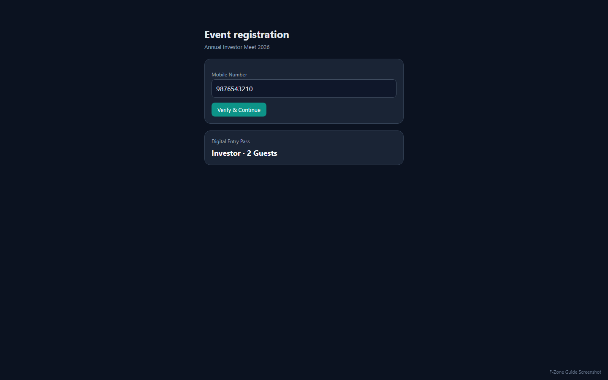

---

## 8. Investor Portal / ഇൻവെസ്റ്റർ പോർട്ടൽ

### Malayalam

URL: `https://fzone-event-managment-system.vercel.app/portal/{event-id}`

1. Mobile number enter ചെയ്യുക.
2. **Load passes** → entry passes, payment status, check-in status കാണാം.
3. Notification links-ൽ ഈ portal deep-link ഉപയോഗിക്കാം.

### English

URL: `https://fzone-event-managment-system.vercel.app/portal/{event-id}`

Investors enter their mobile number and **Load passes** to view their entry passes and status.

---

## 9. Investor Database / User Management

### Malayalam

**User Management** (`/user-management`):

- Columns: No, Code_No, Name, Phone_No, Gender
- **Edit** inline, **Delete**, bulk delete
- **Export All** / **Export Selected** Excel
- Gender stats chips (Total, Male, Female, Other)

Phone number public registration-ൽ verify ചെയ്യാൻ database-ൽ record ഉണ്ടായിരിക്കണം.

### English

Manage all investor records in **User Management**. Export to Excel, edit inline, or delete records. Investors must exist in the database before they can register for events.

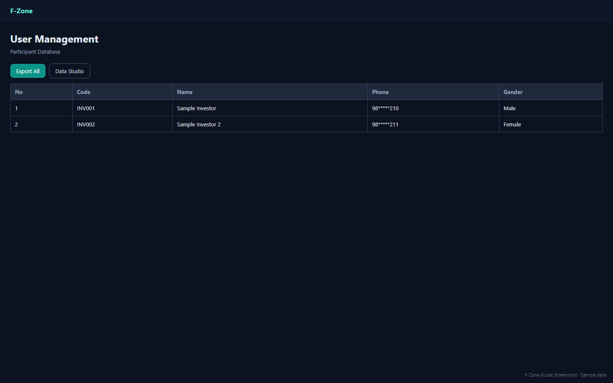

---

## 10. Investor Data Studio / Import

### Malayalam

**Investor Data Studio** (`/user-management/data-studio`):

1. Schema review — required columns: `No`, `Code_No`, `Name`, `Phone_No`, `Gender`
2. **Download template** (.xlsx)
3. Excel fill ചെയ്ത് **Import spreadsheet**
4. Wizard: Upload → Headers → Preview → Validation → Confirm
5. **Recent imports** table-ൽ status & errors

⚠️ Import ചെയ്യുന്നതിന് മുമ്പ് backup/export എടുക്കുക.

### English

Use **Investor Data Studio** to bulk import investors from Excel. Download the template, fill it, upload, validate, then confirm import.

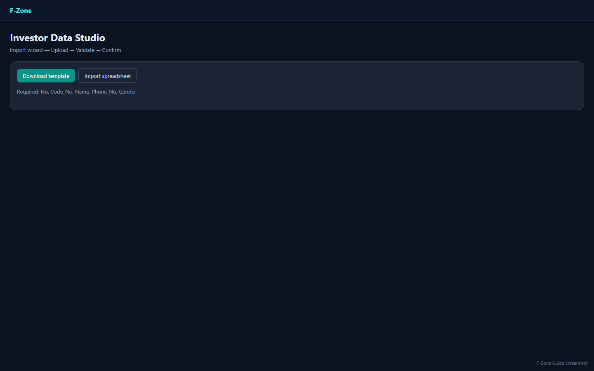

---

## 11. Registrations & Attendance / രജിസ്ട്രേഷൻ & ഹാജർ

### Malayalam

| Page | Route | Use |
|------|-------|-----|
| All Registrations | `/allregistrations` | All bookings filter/search |
| Running Event | `/runningevent/{id}` | Per-event dashboard |
| Attendance Logs | `/attendance-logs` | Event list → attendance |
| Event Attendance | `/event-attendance/{id}` | Block/unblock, export CSV |

**Block investor/guest:** attendance workspace → select row → block (optional reason).

### English

View all registrations, drill into per-event attendance, block participants, and export CSV reports.

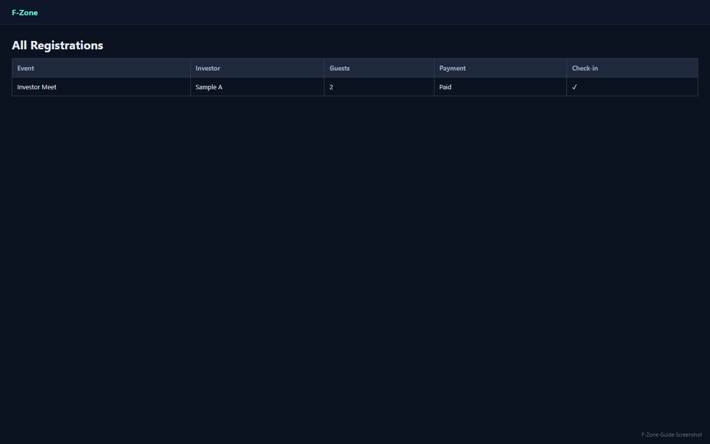

---

## 12. Gate Check-in (Scanner) / ഗേറ്റ് സ്കാൻ

### Malayalam

**Gate Scanner App** (`/gate-scanner`):

1. **Gate** select ചെയ്യുക (Settings-ൽ configure ചെയ്ത gate names).
2. Camera QR scan.
3. Success/fail result — duplicate scan prevented.

Scanner role staff-ന് മാത്രം scanner pages access.

### English

Select a gate, scan the QR code on the entry pass, and confirm check-in. Duplicate scans are blocked automatically.

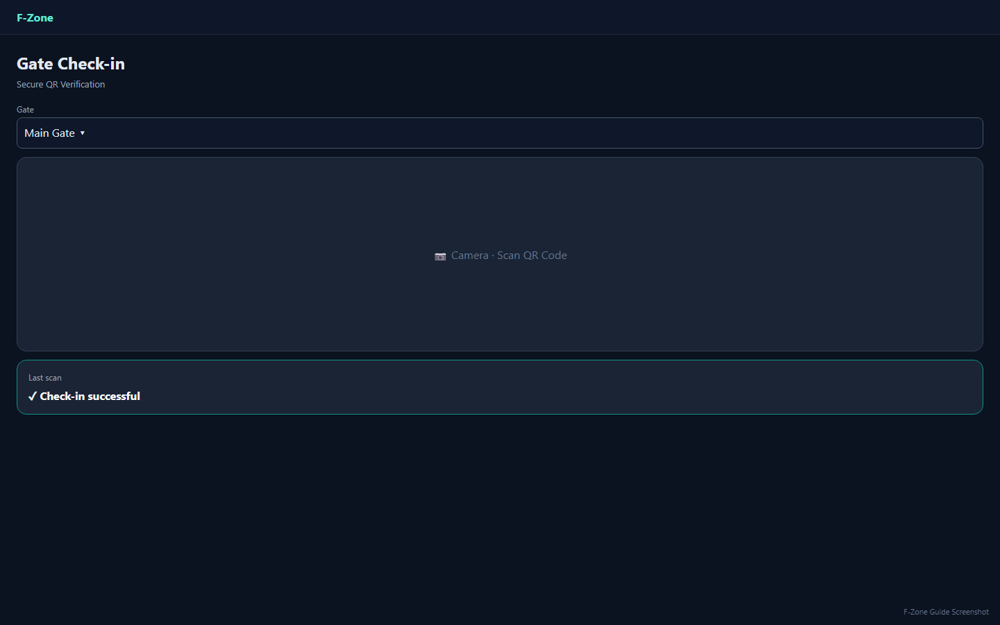

---

## 13. Payments & Refunds / പേയ്മെന്റ്

### Malayalam

**Payments & Revenue** (`/payments`):

1. Ledger with filters (event, status, date, search)
2. **View details** — amount, Razorpay refs, refund history
3. **Issue refund** on eligible payments
4. **Export** CSV

**Finance Reconciliation** (`/finance/reconciliation`) — finance team-ന് mismatch review.

Finance role staff-ന് payments access.

### English

View the payment ledger, issue refunds, export data, and use Finance Reconciliation for detailed review.

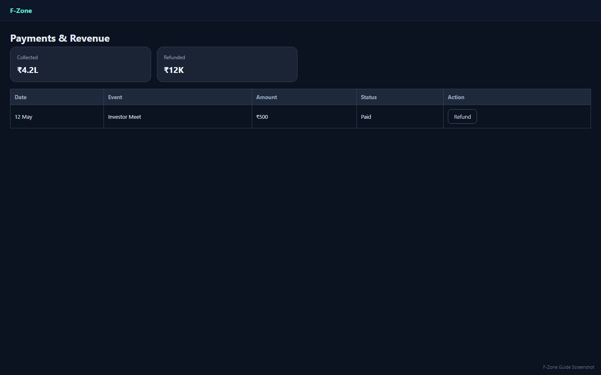

---

## 14. Settings / സെറ്റിംഗ്സ്

### Malayalam

**Settings** (`/settings`):

| Section | Description |
|---------|-------------|
| Appearance | Light / Dark theme |
| Staff accounts | Super admin only |
| Refund access policy | When refunded users lose access |
| Waitlist | Enable when event full |
| Notifications | SMTP email, Twilio SMS (optional) |
| Gate names | Scanner gate dropdown |
| Platform tools | Audit log, Webhooks, Reconciliation shortcuts |

**Save platform settings** button — changes save to database.

### English

Configure theme, gates, refund policy, notifications, and platform behaviour from Settings.

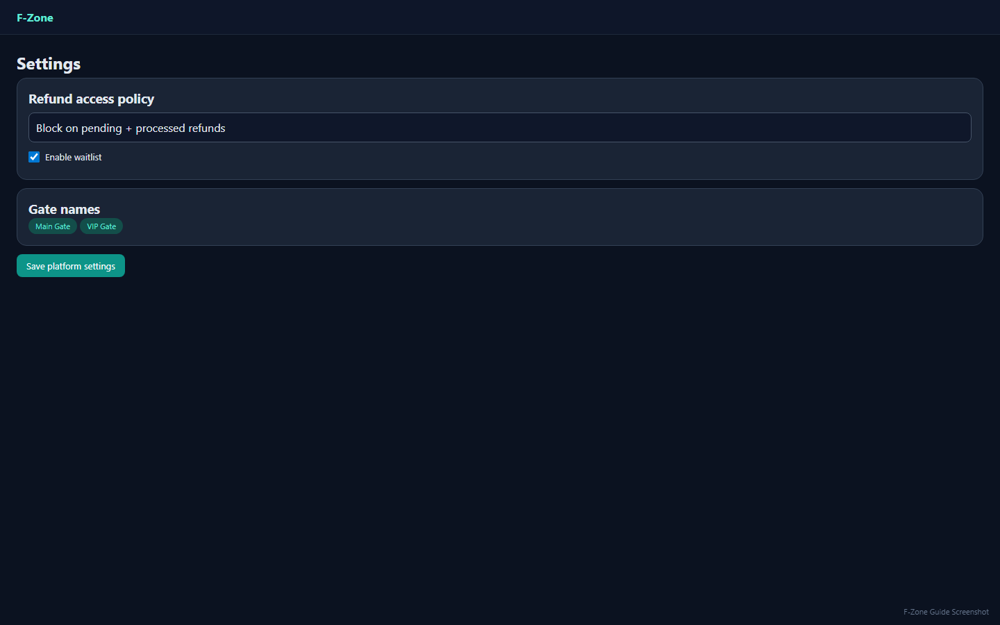

---

## 15. Audit Log / ഓഡിറ്റ് ലോഗ്

### Malayalam

**Audit Log** (`/platform/audit-log`):

- Who did what, when (admin email, role, action)
- Investor edit/delete, refunds, staff changes, settings
- Filters, analytics, CSV export

Investor update/delete-ൽ **actor email** record ആകും.

### English

Track all important admin actions. Filter by category, view details, and export for compliance.

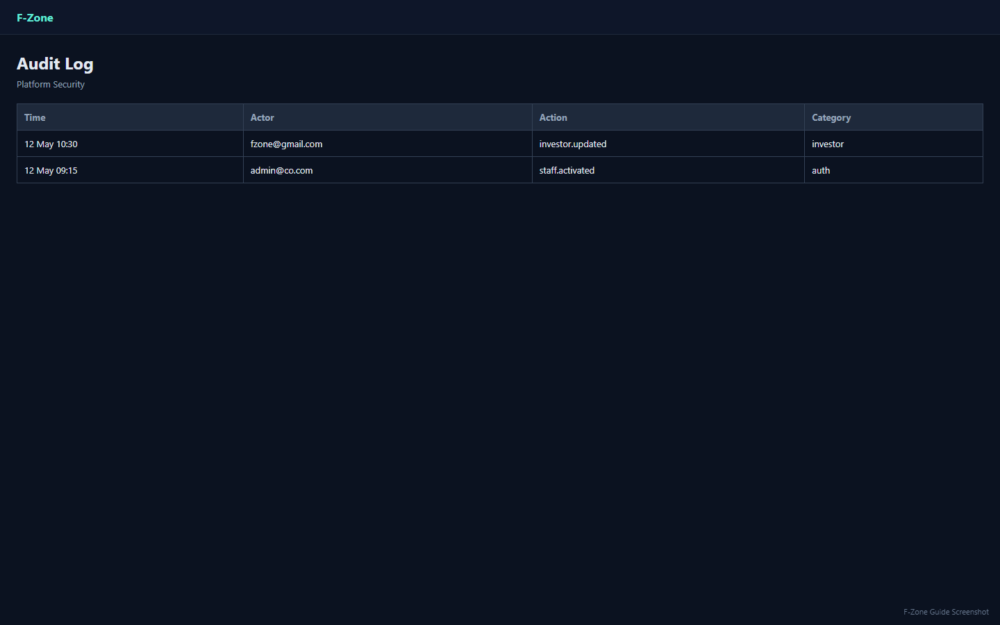

---

## 16. Notifications / അറിയിപ്പുകൾ

### Malayalam

1. Header **bell icon** → recent alerts.
2. **Notification center** (`/notifications`) → full inbox.
3. Overview-ൽ **Recent Alerts** widget.
4. Email/SMS Settings-ൽ configure ചെയ്താൽ external notifications.

### English

Use the header bell and Notification center for real-time platform alerts.

---

## 17. FAQ / പതിവ് ചോദ്യങ്ങൾ

### Malayalam

| Problem | Solution |
|---------|----------|
| Login slow first time | Render cold start — 30–60 sec wait, refresh |
| "Account pending approval" | Super admin Settings → Activate admin |
| "Account disabled" | Super admin re-enable or create new account |
| "Insufficient permissions" | Super admin → Edit Permissions |
| Registration: phone not found | Add investor in User Management or Data Studio import |
| Payment failed | Check Razorpay keys on Render/Vercel |
| Preview URL blocked | Add exact Vercel URL to Render CORS_ORIGINS |

### English

| Problem | Solution |
|---------|----------|
| Slow first login | Wait for Render cold start, then retry |
| Pending approval | Super admin must activate the account |
| Disabled account | Contact super admin |
| Permission denied | Super admin assigns correct permissions |
| Phone not found | Add investor to database first |
| Payment issues | Verify Razorpay configuration |
| CORS errors | Update CORS_ORIGINS on Render |

---

## 18. Security Checklist / സുരക്ഷ

### Malayalam

- [ ] Super admin password rotate ചെയ്ത് secure channel-ൽ മാത്രം share
- [ ] Staff-ന് individual accounts — shared password avoid
- [ ] Scanner/Finance roles — minimum access only
- [ ] Audit log monthly review
- [ ] Investor export backup before bulk import
- [ ] Razorpay webhook secret Render-ൽ set ആണെന്ന് verify

### English

- [ ] Rotate super admin password; share only via secure channel
- [ ] One account per staff member
- [ ] Use Scanner/Finance roles where possible
- [ ] Review audit log regularly
- [ ] Backup before bulk imports
- [ ] Confirm Razorpay webhook is configured

---

## 19. Appendix — Permission Keys / Permission പട്ടിക

| Key | Malayalam | English |
|-----|-----------|---------|
| events:read | Events & dashboard കാണൽ | View events & dashboard |
| events:write | Event create/edit/delete | Create, edit & delete events |
| investors:read | Investors കാണൽ | View investors |
| investors:write | Investor edit/delete | Edit & delete investors |
| investors:import | Data Studio import | Investor Data Studio import |
| registrations:read | Registrations & attendance | View registrations & attendance |
| registrations:write | Block, close registration | Block guests & close registration |
| payments:read | Payment ledger | View payment ledger |
| payments:refund | Refunds | Issue refunds |
| settings:write | Platform settings | Edit platform settings |
| audit:read | Audit log | View audit log |

**Scanner** & **Finance** roles use fixed role-based access — permission checklist applies to **Admin** role only.

---

## Quick Start Summary / ക്വിക്ക് സ്റ്റാർട്ട്

### Malayalam (5 steps)

1. Login: https://fzone-event-managment-system.vercel.app/login (`fzone@gmail.com`)
2. Settings → Staff → team accounts create & activate
3. User Management / Data Studio → investors add
4. Create Event → Copy public link → share
5. Event day → Gate Scanner → QR check-in

### English (5 steps)

1. Login as super admin
2. Create and activate staff accounts
3. Load investor database
4. Create event and share public link
5. Scan QR codes on event day

---

**End of guide / ഗൈഡ് അവസാനിച്ചു**

_For technical deployment details, see `docs/DEPLOY.md` in the project repository._
